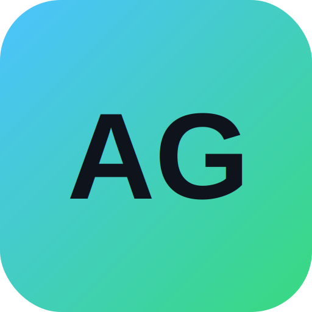

<a id="readme-top"></a>

<!-- PROJECT SHIELDS -->
<div align="center">

[![Contributors][contributors-shield]][contributors-url]
[![Forks][forks-shield]][forks-url]
[![Stargazers][stars-shield]][stars-url]
[![Issues][issues-shield]][issues-url]
[![MIT License][license-shield]][license-url]

</div>

<!-- PROJECT LOGO -->
<br />
<div align="center">
  <a href="https://github.com/gitKBDL/AdvancedGUI-CE">
    
  </a>

  <h3 align="center">AdvancedGUI Community Editor</h3>

  <p align="center">
    Браузерный редактор GUI для плагина AdvancedGUI (Minecraft)
    <br />
    <br />
    <a href="https://gitkbdl.github.io/AdvancedGUI-CE/">
      
    </a>
    <br />
    <br />
    <a href="https://github.com/gitKBDL/AdvancedGUI-CE/issues/new?labels=bug">Сообщить о баге</a>
    &middot;
    <a href="https://github.com/gitKBDL/AdvancedGUI-CE/issues/new?labels=enhancement">Предложить фичу</a>
  </p>
</div>

<!-- TABLE OF CONTENTS -->
<details>
  <summary>Содержание</summary>
  <ol>
    <li>
      <a href="#о-проекте">О проекте</a>
      <ul>
        <li><a href="#стек">Стек</a></li>
      </ul>
    </li>
    <li>
      <a href="#запуск">Запуск</a>
      <ul>
        <li><a href="#требования">Требования</a></li>
        <li><a href="#установка">Установка</a></li>
      </ul>
    </li>
    <li><a href="#использование">Использование</a></li>
    <li><a href="#live-sync">Live-sync</a></li>
    <li><a href="#тесты">Тесты</a></li>
    <li><a href="#участие">Участие</a></li>
    <li><a href="#лицензия">Лицензия</a></li>
  </ol>
</details>

<!-- ABOUT THE PROJECT -->
## О проекте

<!-- TODO: добавь скриншот в images/screenshot.png и раскомментируй:
[![Скриншот редактора][product-screenshot]](https://gitkbdl.github.io/AdvancedGUI-CE/)
-->

Редактор собирает GUI для плагина AdvancedGUI на холсте: компоненты, действия, проверки. Готовый лейаут экспортируется в JSON или отправляется в запущенный плагин по сети (live-sync). Проекты хранятся в браузере, на сторонние серверы ничего не уходит.

<p align="right">(<a href="#readme-top">наверх</a>)</p>

### Стек

[![Vue][Vue.js]][Vue-url]
[![TypeScript][TypeScript]][TypeScript-url]
[![Vite][Vite]][Vite-url]
[![Vitest][Vitest]][Vitest-url]

<p align="right">(<a href="#readme-top">наверх</a>)</p>

<!-- GETTING STARTED -->
## Запуск

### Требования

- Node.js 18+ и npm

### Установка

```bash
git clone https://github.com/gitKBDL/AdvancedGUI-CE.git
cd AdvancedGUI-CE
npm install
npm run dev        # http://localhost:5173
```

<p align="right">(<a href="#readme-top">наверх</a>)</p>

<!-- USAGE -->
## Использование

1. Собери интерфейс на холсте: перетаскивание, ресайз, выравнивание, привязка к сетке. Структуру удобно держать в дереве компонентов; поведение задаётся действиями и проверками.
2. Отправь результат на сервер — либо экспортом в JSON (`plugins/AdvancedGUI/layout/` → `/ag reload`), либо вживую через [live-sync](#live-sync).

Редактор ставится как приложение (PWA): в Chrome/Edge — иконка установки в адресной строке. После установки работает офлайн.

<p align="right">(<a href="#readme-top">наверх</a>)</p>

<!-- LIVE-SYNC -->
## Live-sync

Редактор подключается к WebSocket-серверу плагина (порт 27757 по умолчанию) и при изменениях отправляет текущий лейаут. Плагин применяет его на лету — без перезаливки файла и без внешних сервисов.

1. На сервере: лейаут загружен, затем `/ag sync <key> <layout>` (команду показывает панель Live-sync).
2. Редактор открыт по `http://localhost` (`npm run dev`).
3. В панели: `ws://localhost:27757` → Connect.

Ограничения:

- С https-страницы (в том числе с онлайн-демо) браузер блокирует `ws://` как mixed-content, включая `ws://localhost`. Для live-sync редактор нужно открывать по `http://localhost`, либо ставить `wss://` reverse-proxy перед плагином.
- Ресурсы (картинки, гифки, шрифты) через sync не передаются — после их изменения нужно перезалить layout-файл.
- Порт 27757 принимает данные без аутентификации. Держите его на loopback, наружу не пробрасывайте.

<p align="right">(<a href="#readme-top">наверх</a>)</p>

<!-- TESTS -->
## Тесты

Вывод сериализации сверяется с десериализаторами плагина: контрактные тесты проверяют, что `convertToFinalized` выдаёт ровно тот формат, который плагин разбирает (цвета, шрифты, изображения/гифки, проверки, выравнивание, действия), плюс санитайзер импорта и переназначение ID.

```bash
npm test            # все тесты
npm run coverage    # с покрытием
npm run typecheck   # проверка типов
```

<p align="right">(<a href="#readme-top">наверх</a>)</p>

<!-- CONTRIBUTING -->
## Участие

1. Сделай форк репозитория.
2. Создай ветку: `git checkout -b feature/имя`.
3. Закоммить изменения: `git commit -m 'описание'`.
4. Запушь ветку: `git push origin feature/имя`.
5. Открой Pull Request.

Перед PR прогоняй `npm test`, `npm run lint` и `npm run typecheck`.

<p align="right">(<a href="#readme-top">наверх</a>)</p>

<!-- LICENSE -->
## Лицензия

MIT. Подробности — в файле [LICENSE](LICENSE).

<p align="right">(<a href="#readme-top">наверх</a>)</p>

<!-- MARKDOWN LINKS & IMAGES -->
[contributors-shield]: https://img.shields.io/github/contributors/gitKBDL/AdvancedGUI-CE.svg?style=for-the-badge
[contributors-url]: https://github.com/gitKBDL/AdvancedGUI-CE/graphs/contributors
[forks-shield]: https://img.shields.io/github/forks/gitKBDL/AdvancedGUI-CE.svg?style=for-the-badge
[forks-url]: https://github.com/gitKBDL/AdvancedGUI-CE/network/members
[stars-shield]: https://img.shields.io/github/stars/gitKBDL/AdvancedGUI-CE.svg?style=for-the-badge
[stars-url]: https://github.com/gitKBDL/AdvancedGUI-CE/stargazers
[issues-shield]: https://img.shields.io/github/issues/gitKBDL/AdvancedGUI-CE.svg?style=for-the-badge
[issues-url]: https://github.com/gitKBDL/AdvancedGUI-CE/issues
[license-shield]: https://img.shields.io/github/license/gitKBDL/AdvancedGUI-CE.svg?style=for-the-badge
[license-url]: https://github.com/gitKBDL/AdvancedGUI-CE/blob/main/LICENSE
[product-screenshot]: images/screenshot.png
[Vue.js]: https://img.shields.io/badge/Vue.js-35495E?style=for-the-badge&logo=vuedotjs&logoColor=4FC08D
[Vue-url]: https://vuejs.org/
[TypeScript]: https://img.shields.io/badge/TypeScript-007ACC?style=for-the-badge&logo=typescript&logoColor=white
[TypeScript-url]: https://www.typescriptlang.org/
[Vite]: https://img.shields.io/badge/Vite-646CFF?style=for-the-badge&logo=vite&logoColor=white
[Vite-url]: https://vitejs.dev/
[Vitest]: https://img.shields.io/badge/Vitest-6E9F18?style=for-the-badge&logo=vitest&logoColor=white
[Vitest-url]: https://vitest.dev/
